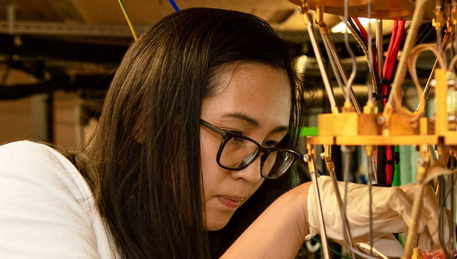

    
    
What is the Data Science Toolkit?
   
    
The Data Science Toolkit provides everyone from professional background to Data Science enthusiasts with packaged, vetted and tested delivery accelerators, delivery guidance, and product backlogs for common machine learning scenarios.
  
    <!--Use the toolkit section-->
    

        

            
        

        

            
Use the toolkit

            

                Have you ever wished for a "push button" way to set up an Azure environment for ML, to get quickly past the boring stuff, and get to the exciting work of building/training a model?
            

            

                <a href="/toolkit/" class="btn btn-primary btn-lg btn-block" target="_blank" style="text-decoration:none;">Use the toolkit</a>
            

        

    

    <!--Contribute section-->
    
        
        

            
Contribute

            

                Have you ever wanted to contributed back to IP and show the great work that has been done for your customer?
            

            

                <a href="/howtocontribute/" class="btn btn-primary btn-lg btn-block" target="_blank" style="text-decoration:none;">Contribute to the toolkit</a>
            

        

        

            
        

    

    <!--Get in touch-->
    

        Get in touch
        

            

                Name
                <input style="margin-top:22px; height:30px" type="text" name="name">
                User type
                    
                
                        <input type="radio" id="customer" name="type" value="1" style="width: 20px;height: 20px;" checked>
                        <label for="customer" style="margin-left: 20px">Customer</label> 
                    

                     
                
                        <input type="radio" id="partner" name="type" value="2" style="width: 20px;height: 20px;">
                        <label for="partner" style="margin-left: 20px">Partner</label> 
                    

                    
                
                        <input type="radio" id="student" name="type" value="3" style="width: 20px;height: 20px;">
                        <label for="student" style="margin-left: 20px">Student</label> 
                    

                    
                
                        <input type="radio" id="microsoft" name="type" value="4" style="width: 20px;height: 20px;">
                        <label for="microsoft" style="margin-left: 20px">Microsoft Employee</label> 
                    

            

            

                Email
                <input style="margin-top:20px; height:30px" type="text" name="name">
                Message
                <textarea style="resize:none; height: 150px;"></textarea>
            

        

        Send message
    

